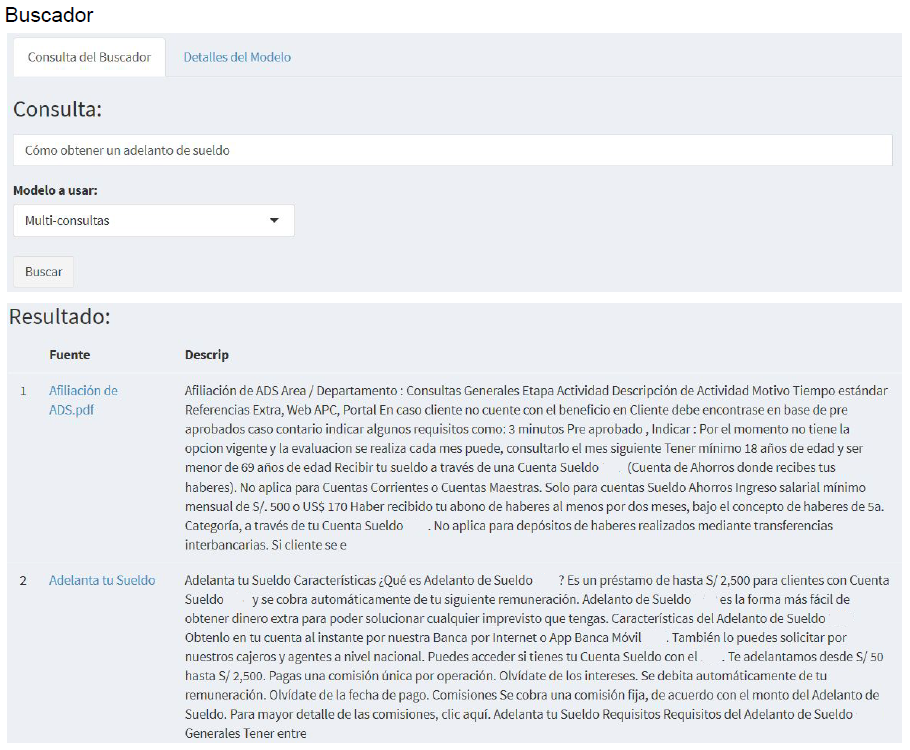

```{r setup, include=FALSE}
knitr::opts_chunk$set(echo = FALSE)
```

Como parte de nuestros desarrollos de speech analytics hemos creado un motor de búsqueda para consultas escritas en lenguaje natural. 

La gran ventaja de este tipo de recursos para la búsqueda de información dentro de la organización, es la posibilidad de conseguir rápidamente la información que se necesita a partir de diferentes fuentes de información heterogénea y no necesariamente estructurada, a partir de consultas realizadas en lenguaje natural con palabras que no necesariamente estén dentro los documentos encontrados, es decir que el motor es capaz de identificar no solo las palabras importantes dentro de la consulta, sino también sinónimos o palabras relacionadas que aumentan la posibilidad de encontrar la información deseada.



Esta interfece web hace llamado al modelo a través de un API implementado en la nube que integra un indexador a textos completos sobre una base de conocimiento previamente preparada y un motor de procesamiento de lenguaje natural (NLP)

Este tipo de recurso tecnológico puede ser de gran utilidad en varia unidades de negocio dentro  de las organizaciones, áreas como 
 - call center y de atención a reclamos, 
 - cumplimiento, 
 - gestión de talento humano, 
 - legal, 
son algunos ejemplos que equipos que verían mejoras en sus procesos internos con la implementación de soluciones como la de un motor de búsqueda integrado con la capacidad de responder a consultas en lenguaje natural

