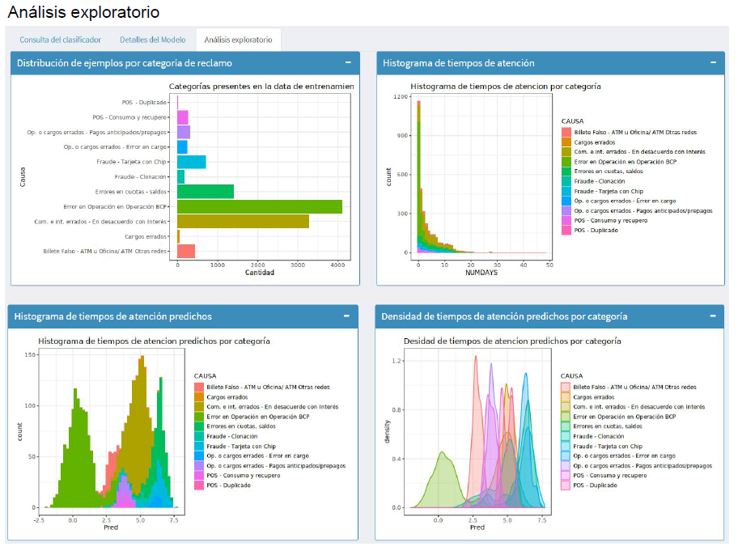

```{r setup, include=FALSE}
knitr::opts_chunk$set(echo = FALSE)

# Learn more about creating blogs with Distill at:
# https://rstudio.github.io/distill/blog.html

```

 <iframe width="560" height="315" src="http://www.youtube.com/embed/Wv2kKPMNR3A?rel=0" frameborder="0" allowfullscreen></iframe>

Bienvenidos a nuestro Catálogo de demostración de IA del Digital Lab de everis Perú. Aquí exponemos un conjunto de POCs, demos y prototipos de casos de uso de la Inteligencia Artificial y el Advanced Analytics.




Ecuacioines matemáticas escritas en latex:
				
$$
\displaystyle\int_{0}^{1}\frac{x\;dx}{x^2+1}=\left.\frac{1}{2}\ln(x^2+1)\right|_0^1=\frac12\ln2
$$


